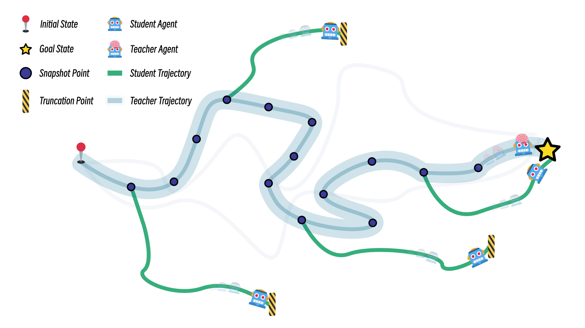

# 🚀 Snapshot Reinforcement Learning: *Leveraging Prior Trajectories for Efficiency*

<p align="center">
<a target="_blank" href="https://arxiv.org/abs/2403.00673"></a>
<a target="_blank" href="https://github.com/sdpkjc/snapshotrl"></a>
<a target="_blank" href="https://huggingface.co/sdpkjc"></a>
<a target="_blank" href="https://wandb.ai/iiiiiiiooo/snapshotrl"></a>
</p>

This repository contains the code for the paper "Snapshot Reinforcement Learning: Leveraging Prior Trajectories for Efficiency" by [Yanxiao Zhao](https://sdpkjc.com), Yangge Qian, Tianyi Wang, Jingyang Shan, Xiaolin Qin.



## Running the code

The code is written in Python 3.9 and PyTorch 2.0.1. To install the required dependencies, run

```bash
pip install -r src/requirements.txt
```

To train the agents, run the following commands:

```bash
# for S3RL+TD3
python src/snapshot_td3_mujoco.py --env-id Hopper-v4 --n-clusters 6 --truncate-step 100 --seed 1

# for SnapshotRL+SC+TD3
python src/snapshot_td3_mujoco.py --env-id Hopper-v4 --n-clusters 6 --truncate-step 1000 --seed 1

# for SnapshotRL+STT+TD3
python src/snapshot_td3_mujoco_random.py --env-id Hopper-v4 --truncate-step 100 --seed 1

# for SnapshotRL+TD3
python src/snapshot_td3_mujoco_random.py --env-id Hopper-v4 --truncate-step 1000 --seed 1


# for S3RL+SAC
python src/snapshot_sac_mujoco.py --env-id Hopper-v4 --n-clusters 6 --truncate-step 100 --seed 1

# for S3RL+PPO
python src/snapshot_ppo_fix_mujoco.py --env-id Hopper-v4 --n-clusters 6 --truncate-step 100 --seed 1
```

## Citing this work

```tex
@article{zhao2024snapshot,
  title={Snapshot Reinforcement Learning: Leveraging Prior Trajectories for Efficiency},
  author={Zhao, Yanxiao and Qian, Yangge and Wang, Tianyi and Shan, Jingyang and Qin, Xiaolin},
  journal={arXiv preprint arXiv:2403.00673},
  year={2024}
}
```
